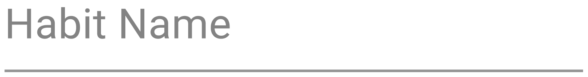
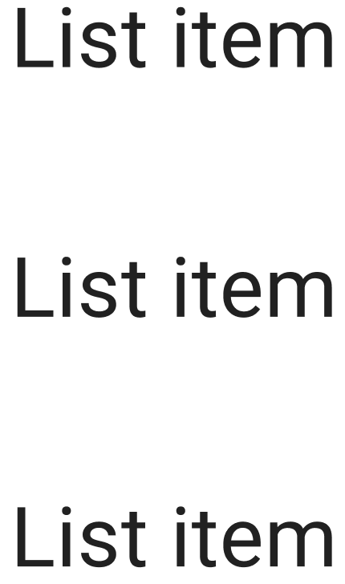
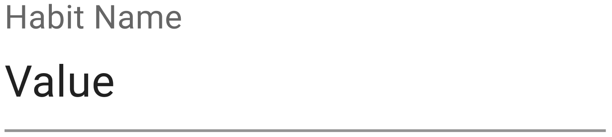

# Habits 

The app I would like to build next is one that comes from tracking my bad habits. It should consist of all my favorite features from an app called Habit Tracker created by Davetech Co, Ltd. I use the Habit Tracker app to track all the habits that I would like to quit. Every week or so, I go into the app and consolidate this information into an excel spreadsheet in which I can see all the data in an easy-to-read place from a month perspective.

### Technical Requirements

The technical requirements should be that this is a MERN stack application that will eventually grow to become an iOS app after I finish the necessary training for this. I will have to learn certain skills such as adding authentication to a MERN stack app using Firebase. I don’t think this authentication is necessary for the initial MVP as I will be the only one using the app to start with. We should design the app to be as simple as possible to contain only the features that are in this document.

### Features

##### New habit
I want to be able to click on a button that allows me to enter the name of the habit I would like to start. The button will say "New Habit" and have a . When I press it, a text box will appear with a check box to the left of it in which I can put the name of the habit and press return on my keyboard. After I press return, I should see this habit appear in the list of habits. If I press return with no text in the text box, then no habit will be added.

| Component | Screenshot |
|----------|----------|
| NewHabitButton    |  |
| NewHabitForm   |     |

```
POST /api/habits
name: <string> 
```

##### View habits
I would like to see a list of all the habits that I have created.

| Component | Screenshot |
|----------|----------|
| HabitList    |  |
```
GET /api/habits
habits: <habits>[]
```

##### Mark complete
I would like the ability to mark any of them complete by clicking on the empty checkbox.

| Component | Screenshot |
|----------|----------|
| Unchecked    |  |
```
POST api/habits/:id/done
```

##### Mark not complete
I should be able to mark a habit not done if it is already marked as complete.

| Component | Screenshot |
|----------|----------|
| Checked    |  |
```
DELETE api/habits/:id/done
```

##### Edit habit
To edit the name of a habit, I should be able to press anywhere in the same line of the habit and then the name of the habit will be made editable similar to the view when adding a habit, the only difference is that the previous name of the habit will prepopulate the form.

| Component | Screenshot |
|----------|----------|
| EditHabitForm    |  |

```
PUT /api/habits/:id
```

##### Delete habit
To delete a habit, I should be able to click on the habit and see a trash can all the way to the right of the row in which I can click. If I click it, then I should be able to see "habitname will be permanently deleted." with subtext "You won't be able to undo this action" with light gray and red buttons  "Cancel" and "Delete habit".

UI components: Delete button, alert 
```
DELETE /api/habits/:id
```

##### Habit detail
I would like to be able to click on a habit to see all the previous days marked in which I have completed or not completed a habit.

```
GET /api/habits/:id
```