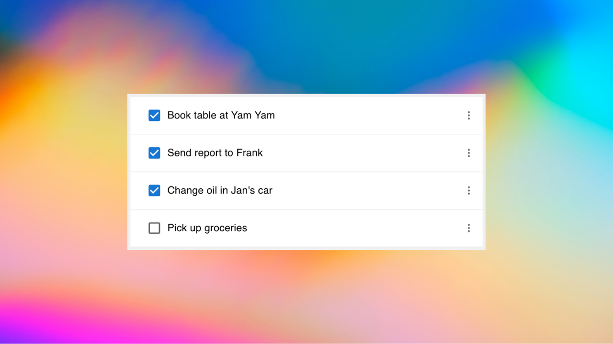
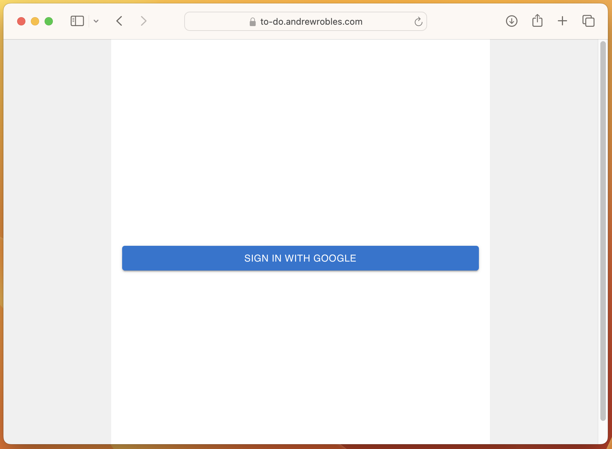
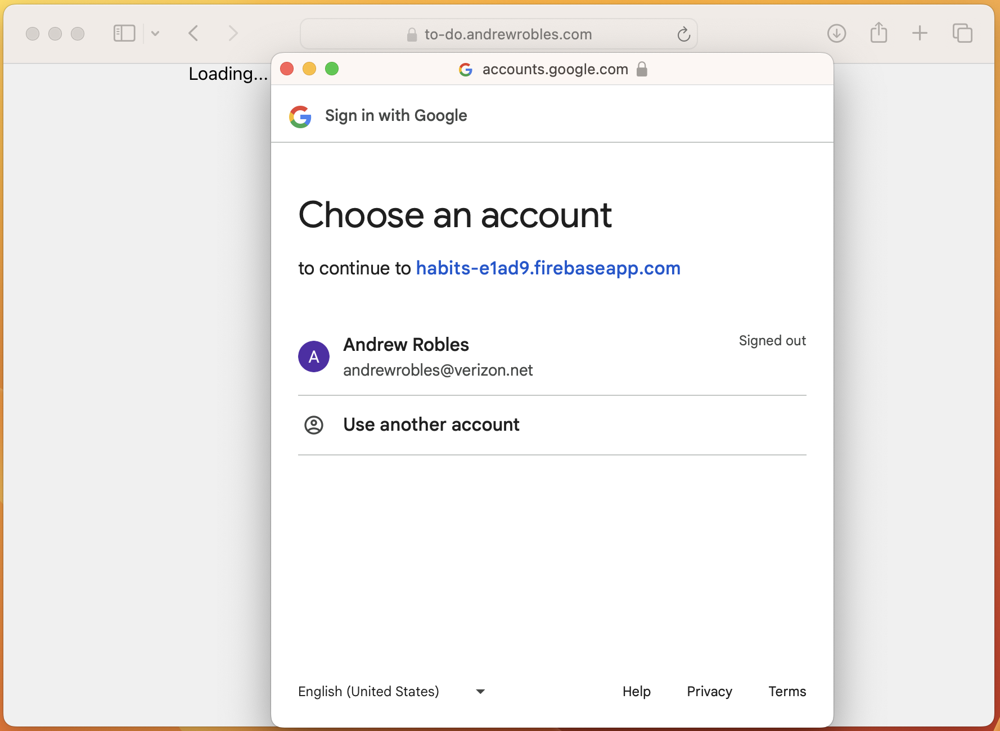
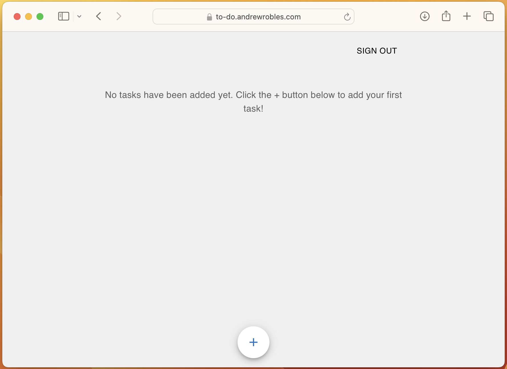
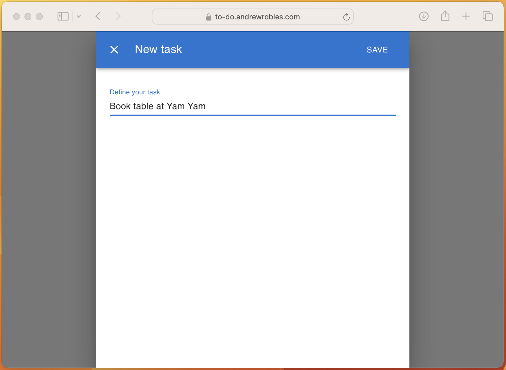
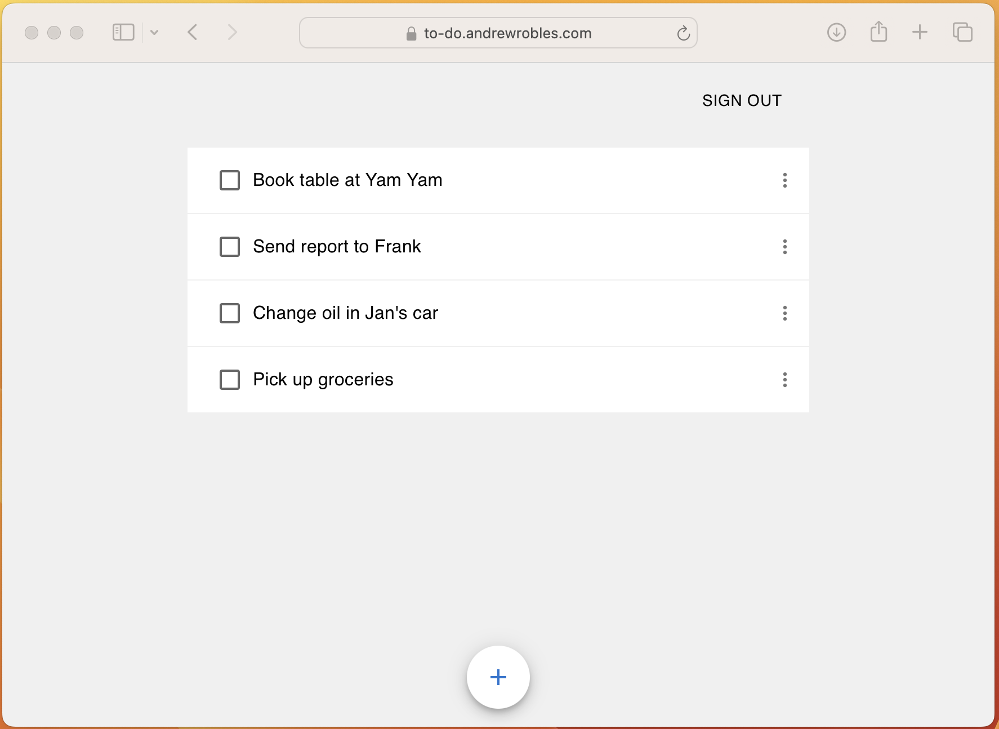
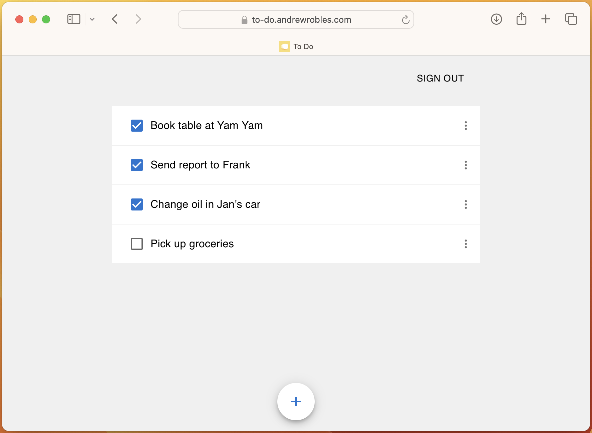

# To Do

A simple, responsive to-do list app for managing tasks efficiently, featuring Google Sign-In for secure user authentication. Additional features include task creation, editing, deletion, and real-time updates. The project showcases skills in frontend and backend development, intuitive UI design, and implementing CRUD functionality. Built with modern web technologies, it demonstrates the ability to create clean, functional, and user-friendly web applications optimized for both desktop and mobile devices, with seamless cross-platform performance.

#### Features

| Feature    | Screenshot |
| -------- | ------- |
|  A minimalist webpage with a centered "Sign in with Google" button for the first step of the sign-in flow |     |
| A Google Sign-In page where users can select from a list of available Google accounts to sign in |     |
| Empty state page with the message, "No tasks have been added yet. Click the + button below to add your first task!" |  | 
| A form for adding a new task, featuring input fields for the task name and details, along with a "Save" button |  | 
| A dynamic list displaying tasks added by the user, complete with task names, details, and options to edit or delete |  |
| A dynamic list displaying tasks added by the user, complete with task names, details, and options to edit or delete |  |
| A list showcasing completed to-do items, with each item visibly marked as done to indicate task completion | 