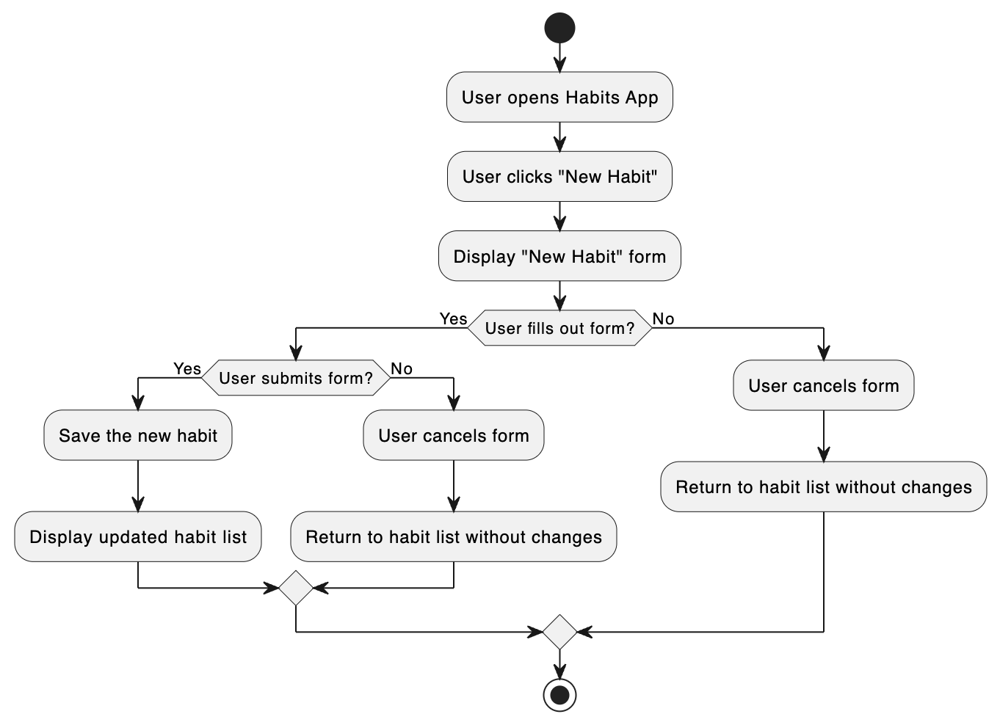

### How to
- Run app locally: cd into the lbs/web/api directory and do `node index.js`, then in another terminal do `npm start` from the lbs/web/ui directory
- Deploy an API change: open up a console in digital ocean and do `pm2 restart index` from the lbs/web/api directory.

### New habit
I want to be able to click on a button that allows me to enter the name of the habit I would like to start. The button will say "New Habit". When I press it, a text box will appear with a check box to the left of it in which I can put the name of the habit and press return on my keyboard. After I press return, I should see this habit appear in the list of habits. If I press return with no text in the text box, then no habit will be added.

```
POST /habits
{
    name: <string> 
}
```

### View habits
I would like to see a list of all the habits that I have created.

```
GET /habits
```



### Mark complete or not complete
I would like the ability to mark any of them complete by clicking on the empty checkbox.

```
PATCH /habits/<id>/<yyyy-mm-dd>
{
    "done": <true or false>
}
```

### Edit habit
To edit the name of a habit, I should be able to press anywhere in the same line of the habit and then the name of the habit will be made editable similar to the view when adding a habit, the only difference is that the previous name of the habit will prepopulate the form.

```
PATCH /habits/<id>
{
    "name": <string>
}
```

### Delete habit
To delete a habit, I should be able to click on the habit and see a trash can all the way to the right of the row in which I can click. If I click it, then I should be able to see "habitname will be permanently deleted." with subtext "You won't be able to undo this action" with light gray and red buttons  "Cancel" and "Delete habit".

```
DELETE /habits/<id>
```

Note that we want to delete all of the events that were referenced for this habit.

### Habit detail
I would like to be able to click on a habit to see all the previous days marked in which I have completed or not completed a habit.

```
GET /habits/<id>
```

### Things to do
- [x] Ping Endpoint: I should be able to do GET /ping and as a response I should get {"message": "pong"}
- [ ] SSL Setup: I should be able to go to /ping using HTTPS and get a valid response using [this guide](https://www.digitalocean.com/community/tutorials/how-to-set-up-a-node-js-application-for-production-on-ubuntu-20-04)
- [ ] UI-API Integration: I should be able to see the contents of the ping endpoint in the browser developer console
